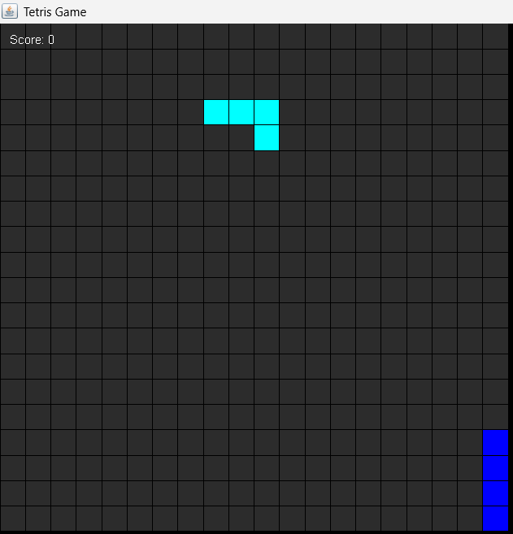
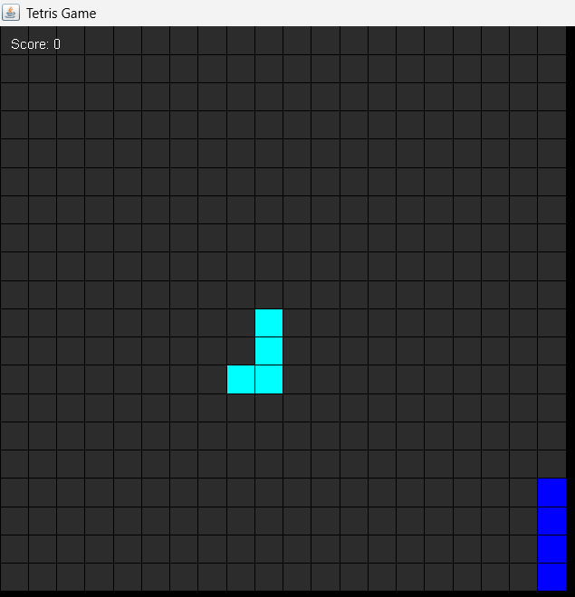
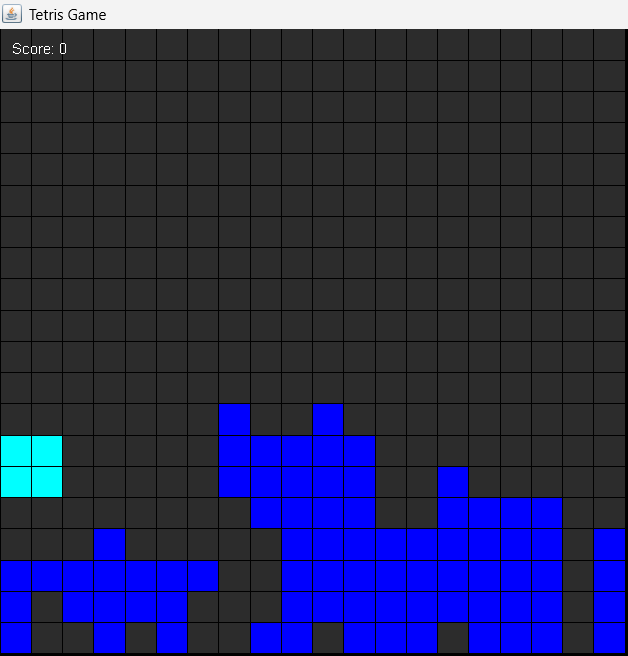
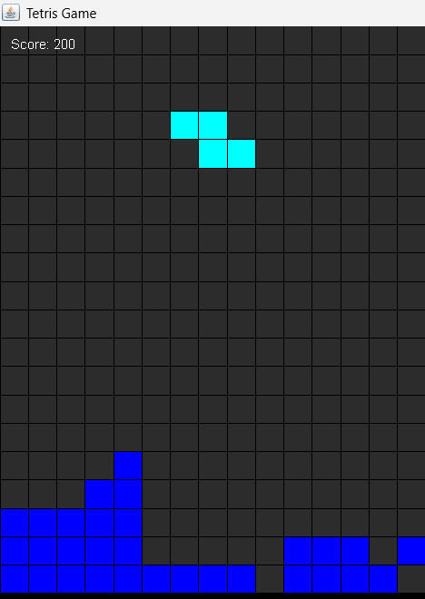
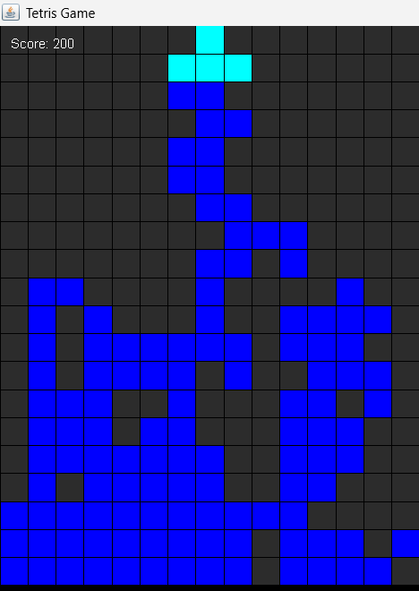

# Tetris Game in Java Swing

## Overview

This project is a classic implementation of the Tetris game developed in Java using the Swing framework for the graphical user interface. It demonstrates object-oriented design principles, event-driven programming, and real-time game mechanics.

The game features standard Tetris gameplay including piece rotation with boundary checks, line clearing, scoring, and smooth piece movement.

---

## Features

- Seven classic Tetromino shapes: I, O, T, S, Z, J, L  
- Rotation with simple wall kick logic to prevent disappearing near walls  
- Line clearing and scoring system  
- Keyboard controls for moving, rotating, soft dropping, and hard dropping pieces  
- Graphical rendering using Java Swing for responsive gameplay on typical laptop screens  
- Adjustable board and cell sizes optimized for desktop and laptop displays  

---

## Installation and Running

1. Download or clone the repository to your local machine.  

2. Open a terminal and navigate to the `src` directory that contains the `tetris` package.  

3. Compile the Java source files:

javac tetris/*.java

4. Run the game with:

java tetris.TetrisUI

---

## Controls

| Key         | Action                     |
|-------------|----------------------------|
| Left Arrow  | Move Tetromino left        |
| Right Arrow | Move Tetromino right       |
| Down Arrow  | Soft drop (move piece down)|
| Up Arrow    | Rotate Tetromino           |
| Space Bar   | Hard drop (instant down)   |

---

## Project Structure

src/
└── tetris/
├── GameBoard.java - Manages the game board grid and line clearing
├── ShapeShapes.java - Defines Tetromino shapes and their rotations
├── ShapeType.java - Enum for Tetromino shape types
├── Tetrimino.java - Represents a Tetromino piece with rotation and position
├── TetrisGame.java - Core game logic and piece control
├── TetrisPanel.java - Swing JPanel for rendering and input handling
└── TetrisUI.java - Main class for launching the Swing application

---

## Screenshots

  
  
  
  
  

---

## Future Improvements

- Add next-piece preview and hold piece functionality  
- Implement advanced rotation systems (e.g., Super Rotation System)  
- Add pause feature and sound effects  
- Support fullscreen mode and customizable controls  

---
